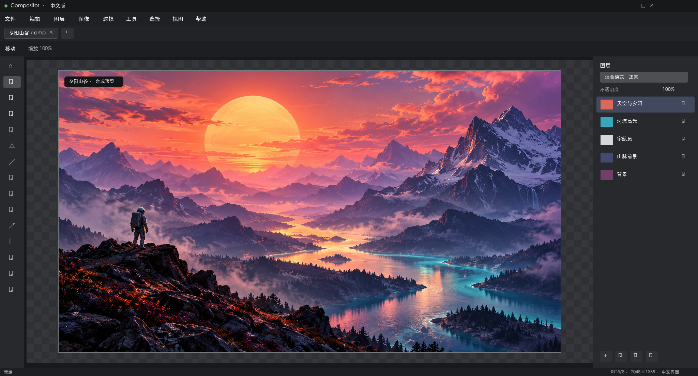

# Compositor 中文 Windows 版

<div align="center">

**一款免费、开源、熟悉 Photoshop 工作流的 Windows 图像编辑器。**

[下载 Windows 版](https://github.com/adfdsfvb3/Compositor/releases/tag/windows-v1.3.7-zh-CN) · [查看源码](https://github.com/adfdsfvb3/Compositor/tree/compositor_win) · [反馈问题](https://github.com/adfdsfvb3/Compositor/issues)

</div>



Compositor Windows 中文版把图层、蒙版、选区、画笔、滤镜、文字和 PSD/PSB 工作流带到 Windows 11。项目免费开源，适合想要简单上手、又不想订阅 Photoshop 的用户。

## 给小白的下载与启动

1. 打开 [Windows 版下载页](https://github.com/adfdsfvb3/Compositor/releases/tag/windows-v1.3.7-zh-CN)，下载 `Compositor-Windows-x64-zh-CN.zip`。
2. 右键 ZIP 文件，选择“全部解压”，解压到一个新文件夹。
3. 双击 `Compositor.Desktop.exe` 启动。它是便携版，不需要安装 .NET，也不需要安装程序。

如果 Windows SmartScreen 弹出提示，请点击“更多信息”，再选择“仍要运行”。只从本仓库的 [Releases](https://github.com/adfdsfvb3/Compositor/releases) 下载文件。

## 系统要求

- Windows 11，64 位（x64）
- 约 300 MB 磁盘空间；大型图片会需要更多内存
- 普通用户运行发布包无需额外运行库

## 你可以做什么

- 用图层、图层组、蒙版、混合模式和调整图层组织复杂合成
- 使用画笔、修复、仿制图章、渐变、形状和文字工具
- 使用高斯模糊、动感模糊、曲线、色阶、色相/饱和度等调整
- 打开和导出常见图片格式，并读写 Compositor 的 `.comp` 项目
- 用 Photoshop 风格快捷键工作，随时撤销并继续编辑

## 与 macOS 版的关系

Windows 分支 [`compositor_win`](https://github.com/adfdsfvb3/Compositor/tree/compositor_win) 是基于 macOS **1.3.7** 功能集手工移植的 Windows 版本，使用 .NET 10 和 Avalonia。它与 macOS 版共享 `.comp` 项目格式，但不是当前 macOS 主线的完整同步版本。

当前已知差异：Windows 版没有依赖 Apple Vision 的 **Remove Background（移除背景）**、**Object Selection（对象选择）** 和 **Select Subject（选择主体）**。需要抠图时，可使用魔棒、套索或颜色范围。更多构建说明与差异请参阅 [`windows/README.md`](windows/README.md)。

## 从源码构建

开发者可安装 [.NET 10 SDK](https://dotnet.microsoft.com/download/dotnet/10.0)，然后运行：

```powershell
dotnet build windows/Compositor.slnx
dotnet test windows/tests/Compositor.Core.Tests/Compositor.Core.Tests.csproj
dotnet publish windows/src/Compositor.Desktop -c Release -o dist-app
```

Windows 桌面端的 CI 会在 `windows-latest` 上构建、运行核心测试和无头窗口检查；这不等同于覆盖所有真实设备和显卡。

## 许可证与致谢

本项目使用 [MIT License](LICENSE)。macOS 原始项目由 [robbietilton/Compositor](https://github.com/robbietilton/Compositor) 创建；Windows 移植代码来自 [chenguisen/Compositor](https://github.com/chenguisen/Compositor/tree/compositor_win)。本分支由 [adfdsfvb3/Compositor](https://github.com/adfdsfvb3/Compositor/tree/compositor_win) 整理并提供中文发行包。

macOS 版说明保存在 [`README.macOS.md`](README.macOS.md)。
